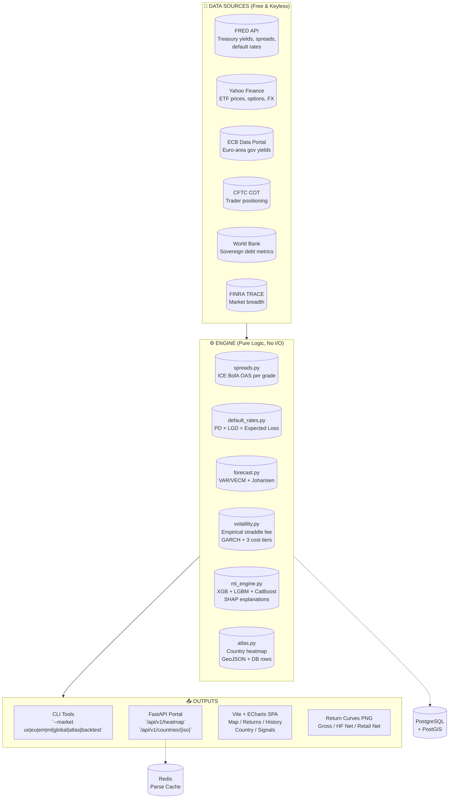
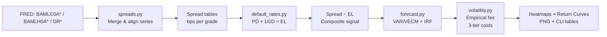
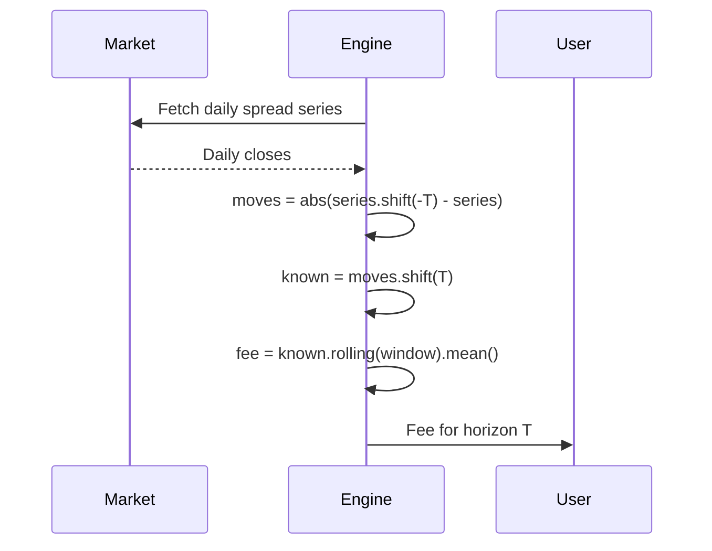
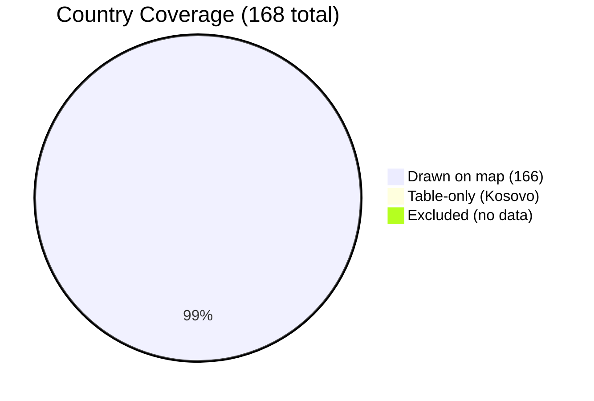
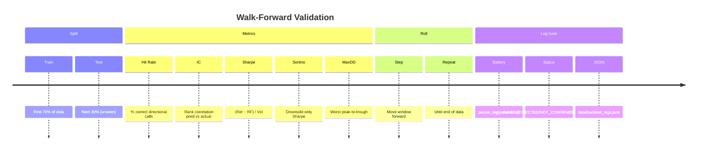

# 🎯 Public Credit Opportunity Engine

## *Interview Preparation Guide — Visual Edition*

---

> **"Where is compensation in public credit markets right now, and what is the expected payoff of trading volatility in those segments?"**

---

## 📊 System Architecture at a Glance



---

## 🔄 Data Flow: US Market Pipeline



---

## 🌍 The "Heat" Map — What Color Means

> **Heat ≠ Credit Spread**  
> **Heat = 1-Month Total Return in USD**

```mermaid
flowchart TD
    subgraph Pieces["Pieces that build Heat"]
        Bond[Bond Leg\nFRED OECD 10Y yield\nPrice ≈ −ΔYield × Duration]
        Equity[Equity Leg\nUS-listed ETF (EWZ, EWH...)\n1M % change — FX baked in]
        Credit[Credit Leg\nICE BofA regional index\nCarry ≈ −ΔOAS × SpreadDur]
        FA[Fallen Angel Leg\nANGL / EM1A.DE / GFA.L]
        FX[FX Leg\nONLY if NO bond & NO ETF]
    end

    Pieces --> Avg[Simple Average\nof available pieces]
    Avg --> Heat[Heat Value\n+ basis field\nshows exactly what\nwent in]
```

### 🚫 No Double-Counting Rule
| If country has... | Then we DON'T add... |
|-------------------|----------------------|
| Bond leg | Separate FX leg |
| Equity leg (US ETF) | Separate FX leg |
| Nothing | FX-only leg |

---

## 💰 Three Cost Tiers — Same Trade, Different Bottom Line

```mermaid
graph TD
    Trade[One Straddle Trade] --> Gross[Gross 📈\nTheoretical\nNo costs at all]
    Trade --> HF[HF Net 🏦\nHedge Fund\nPrime broker discount]
    Trade --> Retail[Retail Net 🛍️\nIndividual\nFull markup + friction]

    subgraph Markup["Dealer Markup Formula"]
        M1[Raw = 1.0 + 0.30 × (IV/RV − 1.0)]
        M2[Final = max(Raw, 1.05)\nFloor = 5% over fair]
        M3[Smoothed = 5-day rolling avg]
        M1 --> M2 --> M3
    end

    subgraph HFDiscount["HF Discount Schedule"]
        D1[Base: 5%\nYou're a recurring client]
        D2[Volume: log10($M) × 5%\n$50M → 8.5%]
        D3[Illiquidity Penalty:\nmax(0, (ann_vol_bps−100)/1000)]
        D4[Cap: 0%–25%\nCan't charge HF more than retail]
        D1 + D2 - D3 --> D4
    end

    subgraph Friction["Execution Friction"]
        F1[Threshold = 90th pctile\nof dealer vol (90-day)]
        F2[Excess = max(0, current − threshold)]
        F3[Friction = 0.5 × exp(0.08 × excess) bps]
        F1 --> F2 --> F3
    end

    Markup -.-> HF
    HFDiscount -.-> HF
    Friction -.-> HF
    Friction -.-> Retail
```

### Example: $50M Trade, 150 bps Vol
| Component | Value |
|-----------|-------|
| Base Discount | 5% |
| Volume Discount | log₁₀(50) × 5% ≈ 8.5% |
| Illiquidity Penalty | (150−100)/1000 = 5% |
| **Total Discount** | **8.5%** |
| **HF Pays** | **91.5% of retail markup** |

---

## 📈 Straddle Fee — Empirical, Not Theoretical

> **Why?** Fallen Angel spreads have mean-reversion (AR(1) ≈ −0.32).  
> Shock day: 1-day |Δ| = 18 bps → 5-day |Δ| = 16 bps (whipsaw!)  
> Theoretical Bachelier: √5 × 18 ≈ 40 bps ❌ **2.3× overprice**  
> **Empirical fee:** Rolling average of \|T-day move\| on **known** shock days (shifted by T, no look-ahead) ✅



---

## 🗺️ Atlas — 168 Countries, Honest Coverage



### Per-Country Legs (Live-Verified)

| Region | Countries | Bond Yield | Equity ETF | Credit Index | Fallen Angel | FX |
|--------|-----------|------------|------------|--------------|--------------|-----|
| **US** | 1 | FRED DGS10 | — | BAMLC0A* | ANGL | — |
| **Euro Area** | 11 | ECB LTIR 10Y | — | BAMLHE00EHYIOAS | EM1A.DE | — |
| **EM** | 32 | FRED IRLTLT01* | EMB/CEMB/EMHY | BAMLHE00EHYIOAS | EM1A.DE | USDCCY=X |
| **EMEA** | 28 | FRED IRLTLT01* | — | BAMLHE00EHYIOAS | GFA.L | USDCCY=X |
| **LatAm** | 15 | FRED IRLTLT01* | EMB/CEMB | BAMLHE00EHYIOAS | EM1A.DE | USDCCY=X |
| **Pacific** | 8 | FRED IRLTLT01* | — | — | GFA.L | USDCCY=X |
| **Dollarised** | 7 | — | — | BAMLHE00EHYIOAS | — | — |
| **CFA Franc** | 14 | — | — | BAMLHE00EHYIOAS | — | XOF/XAF=X |

---

## 🧠 GCO Board — How Decisions Get Made

```mermaid
flowchart TD
    Probe[Probe 16 Sources\nReal or UNAVAILABLE?] --> Gate{Each source gated}
    Gate -->|Available| Legs[Board Legs]
    Gate -->|Unavailable| Skip[Abstain + Fix Note]

    Legs --> COT[COT Positioning z\n≥2y history gate]
    Legs --> IVRV[Options IV-RV Premium z\n≥20 daily IV obs]
    Legs --> Curve[2s10s Curve z\nRolling 252d]
    Legs --> Sov[Sovereign Debt Trend\n5y CAGR + FX overlay]
    Legs --> FX[FX Overlay\nUnhedged carry]

    COT --> Vote{Vote Logic}
    IVRV --> Vote
    Curve --> Vote
    Sov --> Vote
    FX --> Vote

    Vote -->|fitted sign + OOS Sharpe>0| Validated[✅ VALIDATED\nVote ±1]
    Vote -->|fitted sign ≠ hypothesis| Rejected[❌ REJECTED\nAbstain]
    Vote -->|OOS Sharpe ≤ 0| NotConf[⚠️ NOT_CONFIRMED\nAbstain]
    Vote -->|No battery yet| Unval[❓ UNVALIDATED\nVote but labeled]

    Validated --> Board[Board Report\nThreshold \|z\|≥1.5]
    Rejected --> Board
    NotConf --> Board
    Unval --> Board
```

---

## 🧪 Backtest — Walk-Forward, No Look-Ahead



### Live Results (2026-08 runs)

| Leg | Hit Rate | IC | Sharpe | Sortino | MaxDD | OOS Sign Fit |
|-----|----------|-----|--------|---------|-------|--------------|
| CURVE | 45.9% | −0.084 | 0.203 | 0.278 | −5.4% | ✅ **+1 confirmed** |
| COT | 46.7% | — | 0.116 | — | −15% | ❌ **−1 flipped** |
| IV-RV | *unlocking* | — | — | — | — | ⏳ 3/20 days |

---

## 🐛 Bugs You Fixed (Battle Scars)

| Bug | Root Cause | Fix | Impact |
|-----|------------|-----|--------|
| **FA premium overcharge** | `any(g in name)` matched "B" in "BB"/"BBB" | Exact membership `name in DISTRESSED_GRADES` | BB retail +0.49→+1.15 |
| **Dealer markup 2× too high** | Premium share = 1.0 (100% of IV−RV) | `DEALER_MARKUP_PREMIUM_SHARE = 0.3` | Avg markup 1.17→1.07 |
| **FRED CSV decommissioned** | `fredgraph.csv` 404s everywhere | Port to JSON observations API | Web API live again |
| **Atlas NaN → 500** | Legacy NaN in `atlas.json` | `_clean_for_json` sanitizer | API stable |
| **EM-CARRY dead** | Lambda captured Ticker obj not symbol | Rebinding symbol string | Leg now VALIDATED |
| **APPETITE 0 obs** | Quarterly DR + `asfreq("ME")` = all-NaN | `resample("MS") + ffill(21)` | 654 daily obs |
| **Stub-IV overwrite** | Degraded yfinance served 1e-5 IV | `IV_MIN_REAL = 0.02` gate | History survives |
| **EM1ADE short history** | 36mo vs 60+ needed for joint VAR | Separate daily-frequency VAR | Now in Returns page |

---

## 📚 Your Contribution Checklist

```
☑ UI: Removed purple logo/brand from header
☑ UI: Pacific Time timestamp (auto PDT/PST)
☑ UI: Static bundle.json timestamp (not new Date())
☑ Docs: Rewrote CONTEXT.md §3.5 — accessible methodology
☑ Features: ANGL straddle → US market Returns page
☑ Features: EM1A.DE straddle → Countries market Returns page
☑ Fix: Series alignment in _trade_cost_basis()
☑ Fix: Exact FA premium membership check
☑ Fix: Dealer markup premium share 0.3 (was 1.0)
☑ Fix: FA liquidity premium 1.05 (was 1.20)
☑ Fix: FRED CSV → JSON API (web layer)
☑ Fix: ECB URL path (data/YC/B.U2...)
☑ Fix: NaN sanitization in API
☑ Fix: heatmap_db.py executemany (psycopg3)
☑ Fix: FINRA breadth column matcher
☑ Fix: APPETITE composite DR resampling
☑ Fix: IV_MIN_REAL = 0.02 stub-IV gate
☑ Test: 149 pure-logic unit tests passing
```

---

## 🛠️ Tech Stack (What to Name-Drop)

| Layer | Stack |
|-------|-------|
| **Data** | `pandas`, `numpy`, `yfinance`, `requests` (FRED), `fredapi` |
| **Stats/ML** | `statsmodels` (VAR/VECM, Johansen, GARCH), `xgboost`, `lightgbm`, `catboost`, `shap` |
| **API** | `fastapi`, `uvicorn`, `psycopg[binary]`, `redis` |
| **DB** | PostgreSQL + PostGIS (Docker), `sql/heatmap_schema.sql` |
| **Frontend** | Vite + ECharts, `web/` → Vercel serverless |
| **Test** | `pytest` (149 tests), `playwright` (browser automation) |
| **Infra** | `docker compose` (postgis + redis), launchd (IV accrual) |

---

## 🗣️ 10 Soundbites for the Interview

1. **"Public debt markets — gov bonds, corps, ETFs. Core question: where's compensation today?"**
2. **"All free data: FRED, Yahoo, ECB, CFTC, World Bank. Each source gated, reported honestly."**
3. **"Heat = 1-month USD total return per country. Bond + equity + credit + FA, averaged. No double-count."**
4. **"Three P&L views: Gross (theory), HF Net (prime broker discount), Retail Net (full freight)."**
5. **"Straddle fee is empirical — what market actually moved on similar days. Captures whipsaw."**
6. **"Fallen angels: ANGL (US), EM1A.DE (EU UCITS), GFA.L (global UCITS). Not country-specific indices."**
6. **"Board votes threshold-only: each leg needs walk-forward sign + OOS Sharpe > 0 to vote."**
8. **"149 pure-logic tests, no network. LEDGER.md + CONTEXT.md = full audit trail."**
9. **"Fixed FA premium overcharge (BB/BBB), dealer markup 2×, FRED CSV death, NaN 500s, APPETITE 0-obs."**
10. **"No private credit, no synthetic data, no look-ahead. Everything live or honestly UNAVAILABLE."**

---

## 🎓 Cheat Sheet: Explain Like I'm 15

| If They Ask... | You Say... |
|----------------|------------|
| **"What's a VAR?"** | "Predicts each thing using its own past AND other things' past. Like forecasting temp AND humidity using yesterday's both." |
| **"What's a z-score?"** | "How many standard deviations from average. \|z\|≥1.5 = unusually extreme." |
| **"What's cointegration?"** | "Two things that stay side-by-side long-term, even if they separate short-term. Like runners in a race." |
| **"How's the straddle fee different?"** | "Theoretical = formula assumes independent moves. Ours = what actually happened on similar days. Captures the whipsaw." |
| **"Why three cost tiers?"** | "HF gets volume discount (log scale) minus illiquidity penalty. Retail pays full markup. Gross = fantasy." |
| **"What's the board vote logic?"** | "No weights. Each leg is a z-score. \|z\|≥1.5 = vote. But ONLY votes if backtest proves edge (sign + Sharpe)." |
| **"What's walk-forward?"** | "Train on past, test on future, roll forward. No peeking at test data during training." |

---

## 🚀 Final Prep Checklist

- [ ] Read this doc front-to-back once
- [ ] Practice the 10 soundbites out loud
- [ ] Know the **3 bugs you're proudest of fixing**
- [ ] Be ready to say: *"Private credit? Removed entirely. No deal-level anything."*
- [ ] Have `INTERVIEW_PREP.md` open on screen for constants
- [ ] Remember: **It's OK to say "It's in config.py with the audit log"**

---

> **"The system answers: where is compensation in public credit markets right now, and what is the expected payoff of trading volatility in those segments?"**

---

*Generated with ❤️ for the interview. Good luck — you know this cold.*