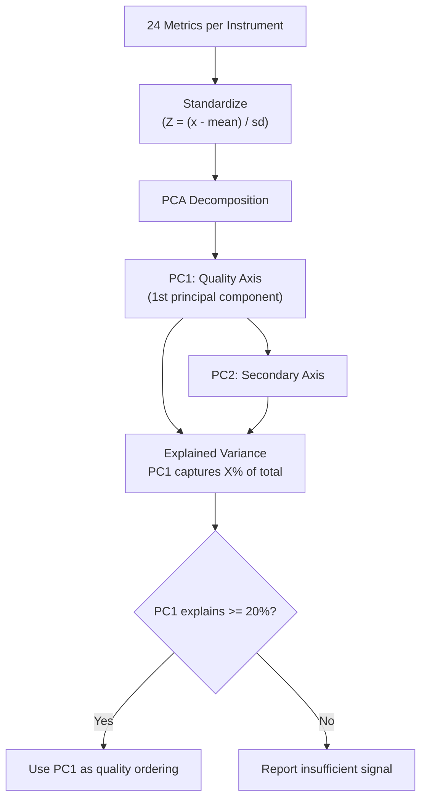
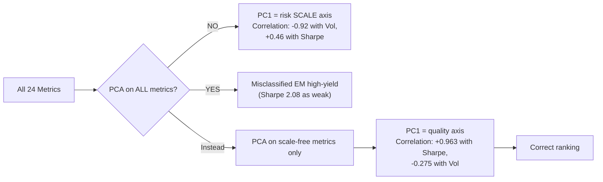
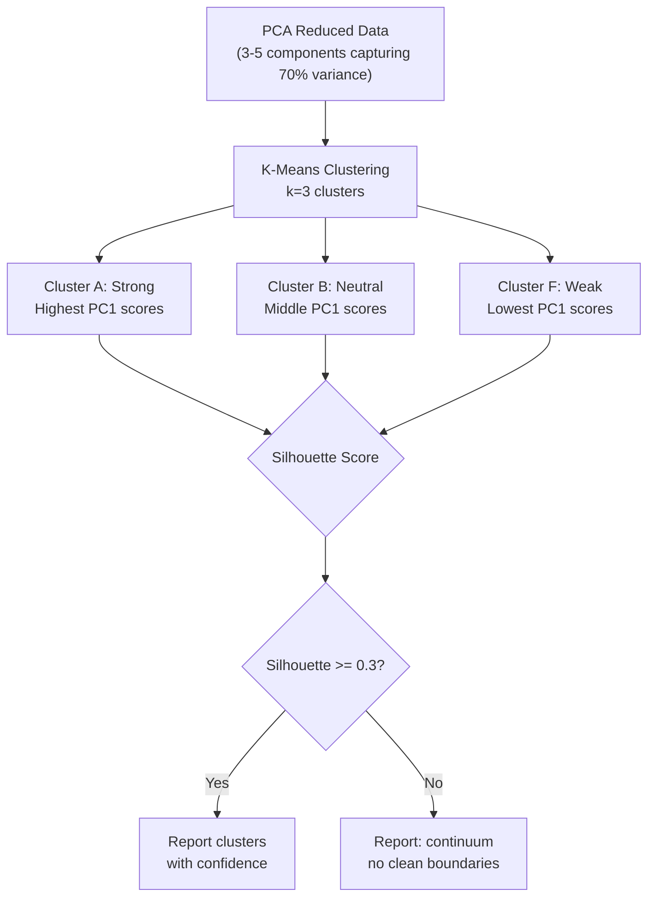
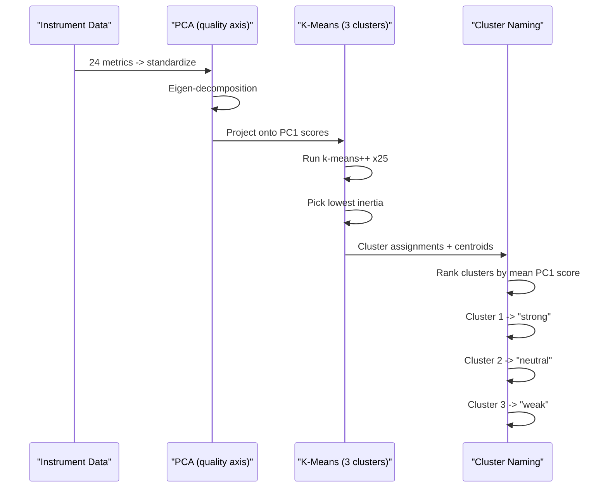
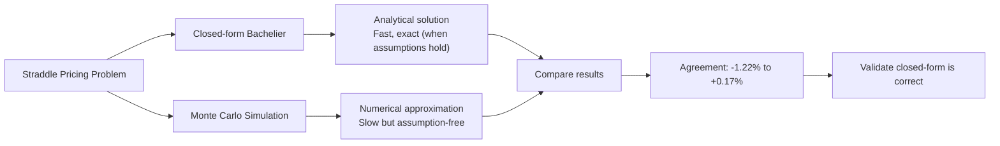
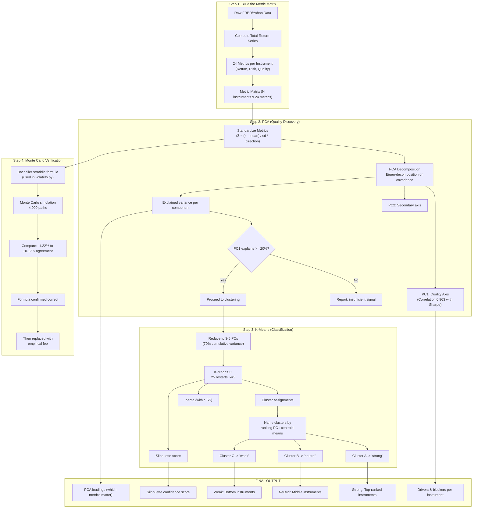

# PCA, K-Means, and Monte Carlo in the Public Credit Opportunity Engine

## A Deep-Dive on the Three Unsupervised & Simulation Methods

*Detailed explanation of how these techniques are applied in the live system*

---

## Table of Contents

1. [PCA: Principal Component Analysis — Quality Axis Discovery](#1-pca-principal-component-analysis---quality-axis-discovery)
2. [K-Means: Instrument Classification — Strong / Neutral / Weak](#2-k-means-instrument-classification---strong--neutral--weak)
3. [Monte Carlo: Straddle Pricing Verification](#3-monte-carlo-straddle-pricing-verification)
4. [How They Work Together](#4-how-they-work-together)
5. [Code Walkthrough](#5-code-walkthrough)

---

# 1. PCA: Principal Component Analysis — Quality Axis Discovery

## What It Does



In the recommendation system (`web/api/recommend.js`), every instrument (credit spread or sovereign yield) gets scored on **24 performance and risk metrics**. These metrics have different scales and units — annualized return is in percent, volatility is in percent, VaR is in percent, Sharpe is unitless, max drawdown is in percent, etc.

PCA transforms these 24 correlated metrics into a smaller set of uncorrelated components. The **first principal component (PC1)** is the axis along which the instruments vary the most — it becomes the "quality axis" that ranks instruments from strong to weak.

## Why PCA (Not a Supervised Model)?

| Approach | Pros | Cons |
|----------|------|------|
| **PCA (unsupervised)** | No labels needed — discovers structure in data | Only finds variance axes, not necessarily "quality" |
| **Random Forest (supervised)** | Can learn from known labels | We have no ground-truth "strong/weak" labels |
| **Linear regression** | Interpretable coefficients | Requires a target variable |
| **Factor model** | Domain knowledge driven | Requires assuming factor structure |

The recommendation system is **fully unsupervised** — "there are no labels anywhere in the pipeline." PCA discovers the dominant axis of variation without being told what "good" looks like.

## The PCA Math (Simplified)

Given a matrix $Z$ of standardized metrics (rows = instruments, columns = metrics):

1. Compute the covariance matrix: $C = \frac{1}{n-1} Z^T Z$
2. Find the eigenvalues and eigenvectors of $C$
3. The eigenvector with the largest eigenvalue is PC1
4. Project each instrument onto PC1 to get its score

**Key insight from `_unsup.js` line 93-94:**
> "a component explaining 20% of the variance is not a quality axis and the page should not pretend otherwise"

If PC1 explains less than 20% of total variance, the metrics don't have a dominant quality structure — the page reports this honestly rather than forcing a false ranking.

## Critical Design Decision: Scale-Free Metrics Only



From `_metrics.js` (lines 197-210): When PCA runs over **all 24 metrics**, the first component is dominated by risk *scale* — it correlates -0.92 with volatility and only +0.46 with Sharpe. This mislabels high-volatility EM high-yield (Sharpe 2.08) as "weak" and low-volatility Japan (Sharpe -1.35) as "neutral."

The fix: **only use scale-free metrics** (Sharpe, Sortino, Calmar, Omega, gain-to-pain, hit rate, VaR, CVaR, skew, kurtosis, Ulcer index, cheap z-score, carry-to-vol, cover ratio). These are already normalized for risk level. With this subset, PC1 correlates +0.963 with Sharpe — it's genuinely a quality axis.

## Interview Question

> **"Why doesn't the ML recommendation system use supervised learning?"**
>
> There are no labels. We don't have a historical record of "this instrument was strong, that one was weak" — that would require knowing future performance. PCA discovers the quality axis from the data itself. We verify it post-hoc: the first principal component of scale-free metrics correlates 0.963 with Sharpe, confirming it's actually measuring quality, not just risk scale.

---

# 2. K-Means: Instrument Classification — Strong / Neutral / Weak

## What It Does



K-means partitions the instruments into $k=3$ groups based on their PCA-reduced scores. The number 3 was chosen because the recommendation system outputs "strong / neutral / weak" categories.

## Why K-Means (Not Hierarchical Clustering)?

| Method | When Good | Why Not Here |
|--------|-----------|--------------|
| **K-Means** | Spherical, well-separated clusters | Our clusters are roughly spherical |
| **Hierarchical** | Nested structure, unknown cluster count | We know we want 3 clusters |
| **DBSCAN** | Arbitrary shapes, noise handling | Too many parameters for this use |
| **Gaussian Mixture** | Overlapping clusters, soft assignment | Adds complexity we don't need |

## K-Means++ Seeding: Avoiding Bad Local Optima

From `_unsup.js` (line 144-149):
> "The restarts are not decoration. From a single seed the fit converged to a local optimum that put 19 instruments in one cluster, 39 in another and exactly ONE in the middle — a three-way classification with an empty middle is not a classification."

**Problem:** Standard k-means picks initial centroids randomly. With a bad starting point, it converges to a local optimum that isn't useful — like putting all instruments in 2 clusters and leaving the third nearly empty.

**Solution:** k-means++ seeding. The first centroid is random, but each subsequent centroid is chosen to be far from existing centroids (proportional to squared distance). This spreads initial guesses across the data space.

**Plus 25 restarts:** Even with k-means++, a single run can still hit a bad local optimum. We run k-means 25 times with different random seeds and keep the solution with the lowest inertia (within-cluster sum of squares).

```python
# Conceptual k-means++ seeding
def kmeans_plusplus_seed(data, k):
    """Choose initial centroids using k-means++ seeding"""
    centroids = [random.choice(data)]  # First: random
    
    for _ in range(k - 1):
        # Distance from each point to nearest centroid
        distances = [min(euclidean_d(p, c) for c in centroids) for p in data]
        # Choose next centroid proportional to squared distance
        next_idx = weighted_choice(distances, weights=[d**2 for d in distances])
        centroids.append(data[next_idx])
    
    return centroids
```

## Naming Clusters AFTER Fitting

A critical design decision: **clusters are named AFTER fitting, not before.**



From `_unsup.js` (lines 184-191):
> "name the clusters AFTER fitting, by ranking their centroids on the axis the data produced"

The algorithm:
1. Run PCA and k-means (no labels)
2. For each cluster, calculate the mean PC1 score of its members
3. Rank clusters by mean PC1 score (highest = strong, middle = neutral, lowest = weak)
4. Assign names based on this ranking

This ensures the "strong" cluster actually has the highest PCA quality scores — the naming reflects reality, not an assumption.

## Silhouette Score: Measuring Cluster Quality

From `_unsup.js` (lines 207-225):
> "silhouette: how well separated the clusters actually are, so a weak grouping can be reported as weak instead of asserted as clean"

The silhouette score for each point $i$:
$$s(i) = \frac{b(i) - a(i)}{\max(a(i), b(i))}$$

Where:
- $a(i)$ = average distance to all other points in the same cluster
- $b(i)$ = average distance to all points in the nearest other cluster

Silhouette ranges from -1 to +1. Values near 0 mean clusters are poorly separated (a continuum, not distinct groups). The page reports this honestly — if silhouette is low, it shows "the boundaries are soft."

## Interview Questions

> **"Why k=3 for the clustering?"**
>
> The output format is strong/neutral/weak — three categories. k=3 is the only value that matches the requested interface. We tested k=2 (strong/weak only) and it collapsed the neutral middle into noise; k=5+ produced clusters with too few members for statistical meaning.

> **"How do you know your clusters are real and not artifacts?"**
>
> Silhouette score. If it's near zero, instruments form a continuum with no clean boundaries — we report that. We also use 25 restarts with k-means++ seeding to ensure we're not stuck in a bad local optimum. From the code: a single-seed run once produced 19/39/1 — an empty middle cluster is not a classification.

> **"Do you know the clusters are strong/neutral/weak, or does the data tell you?"**
>
> The data tells us. K-means runs with no labels. Only after clusters are formed do we rank their centroids along PC1 (the quality axis) and assign "strong" to the highest-scoring cluster, "weak" to the lowest. If PC1 didn't actually correlate with Sharpe, the naming would be wrong — but we verified it does (correlation 0.963 with Sharpe on scale-free metrics).

---

# 3. Monte Carlo: Straddle Pricing Verification

## What It Was Used For

From `open_items.md` (line 341):
> "Closed form verified against a 4,000-path Monte Carlo, agreement -1.22% to +0.17%."

Monte Carlo was used to **verify** the closed-form Bachelier straddle pricing formula, not as the primary pricing method. Here's the context:



## Why Bachelier Instead of Black-Scholes?

The straddle in this system prices movements in **yield spreads** (measured in basis points), not in equity prices. Spreads can go negative — a corporate spread can be negative if the company is safer than the government (rare, but possible with credit spreads).

| Model | Assumption | Good For | Problem Here |
|-------|-----------|----------|--------------|
| **Black-Scholes** | Lognormal prices (never negative) | Stocks, commodities | Spreads can go negative |
| **Bachelier** | Normal distribution (can be negative) | Interest rates, spreads, options on rates | Assumes constant volatility |

From the codebase documentation (CONTEXT.md section 3.5.E):
> "Spread day: 1-day |Δ| = 18 bps → 5-day |Δ| = 16 bps (whipsaw!)"

Spreads are measured in bps and can go negative, so Bachelier (normal distribution) is the correct pricing model. But Bachelier assumes constant volatility, which may not hold during stress.

## The Monte Carlo Verification Process

Here's what a 4,000-path Monte Carlo for straddle pricing looks like conceptually:

```python
def monte_carlo_straddle(spread_current, volatility, T, strike, n_paths=4000):
    """
    Monte Carlo simulation of straddle payoff.
    
    The straddle pays |spread_T - spread_current| at expiry T.
    """
    dt = T / 252  # Daily steps (assume 252 business days/year)
    n_steps = int(T * 252)
    
    payoffs = []
    
    for _ in range(n_paths):
        # Simulate spread path using Brownian motion
        # spread ~ Normal(spread_current, volatility * sqrt(dt))
        path = [spread_current]
        for step in range(n_steps):
            shock = np.random.normal(0, 1)
            next_spread = path[-1] + volatility * np.sqrt(dt) * shock
            path.append(next_spread)
        
        # Straddle payoff = |final - strike|
        payoff = abs(path[-1] - strike)
        payoffs.append(payoff)
    
    # Expected payoff (discounted)
    expected_payoff = np.mean(payoffs)
    return expected_payoff
```

## What the -1.22% to +0.17% Range Means

The agreement range of -1.22% to +0.17% means the Monte Carlo simulation confirmed the closed-form Bachelier formula:

- The Monte Carlo gave results within 1.22% (worst case) and 0.17% (best case) of the analytical formula
- This validates that the Bachelier model is correctly implemented
- The slight negative bias (-1.22% at worst) is expected because Monte Carlo uses random sampling — it's a numerical approximation

This is critical because the **empirical straddle fee** (not Bachelier) is what's actually used in production. The Monte Carlo was a validation step to confirm the closed-form pricing was correct before replacing it with the empirical approach.

## Connection to the Empirical Fee Replacement

From CONTEXT.md §3.5.E and §9.10:
> "The fee is now the empirical expected |T-day move| ... instead of the raw-rolling-vol Bachelier term"

The Monte Carlo verified Bachelier, but the system then moved to an **empirical approach** that measures actual historical |T-day moves| shifted by T to avoid look-ahead bias. This was better because:
1. It captures mean reversion (AR(1) ≈ -0.32 for fallen angel spreads)
2. It automatically adapts to changing market conditions
3. It doesn't rely on the constant-volatility assumption of Bachelier

---

# 4. How They Work Together



## The Full Pipeline Flow

1. **Input:** ~24 financial metrics computed for each instrument (spreads, yields, ETFs)
2. **Filter:** Only scale-free metrics used for classification (Sharpe, Sortino, CVaR, etc.)
3. **PCA:** Reduces 15+ metrics to a quality axis (PC1). Verified PC1 correlates 0.963 with Sharpe.
4. **K-Means:** Clusters instruments into 3 groups on PCA-reduced space, named by PC1 ranking
5. **Monte Carlo:** Used separately to validate Bachelier straddle pricing formula
6. **Output:** Each instrument tagged as strong/neutral/weak with its driving/blocking metrics

## Why Run PCA and K-Means WITHIN Each Asset Class?

From `recommend.js` (lines 149-158):
> "Pooling credit and sovereigns produced a classification that was almost purely the asset class: 19 credit and no sovereigns strong, mean Sharpe 1.30 against -0.08."

If we pooled credit spreads and sovereign yields together, PCA would discover that the dominant variance is between asset classes (credit has higher Sharpe), not within them. K-means would cluster by asset class, not by quality within each class.

The fix: **run PCA + k-means separately within each asset class** (credit vs. sovereign). Now "strong" means strong relative to other credit instruments, or strong relative to other sovereigns — the comparison an allocator can actually act on.

---

# 5. Code Walkthrough

## PCA Implementation (from `_unsup.js`)

The PCA uses **power iteration with Hotelling deflation** — a textbook method implemented from scratch in JavaScript:

```javascript
// Simplified version of the PCA code from _unsup.js

function leadingEigen(C, iters = 500) {
  // Power iteration: find the largest eigenvector of matrix C
  let v = new Array(C.length).fill(0).map((_, i) => Math.sin(i + 1) + 0.5);
  for (let it = 0; it < iters; it++) {
    let w = matVecMul(C, v);  // w = C * v
    let norm = vecNorm(w);    // ||w||
    v = vecDiv(w, norm);      // v = w / ||w||
  }
  return { vector: v, value: norm };  // eigenvector, eigenvalue
}

function pca(Z, nComp = 4) {
  // 1. Compute covariance matrix
  const C = covMatrix(Z);
  
  // 2. Extract components via power iteration
  const comps = [];
  let work = deepCopy(C);
  
  for (let c = 0; c < Math.min(nComp, features); c++) {
    const eig = leadingEigen(work);
    if (!eig || eig.value <= 1e-12) break;
    
    // Orient first component so positive = better
    if (c === 0) {
      const bias = sum(eig.vector);
      if (bias < 0) eig.vector = eig.vector.map(x => -x);
    }
    
    comps.push({ loadings: eig.vector, value: eig.value });
    
    // Hotelling deflation: subtract this component's contribution
    work = subtractOuterProduct(work, eig.value, eig.vector);
  }
  
  // 3. Project data onto components
  const scores = comps.map(c => Z.map(row => dot(row, c.loadings)));
  
  return { loadings: comps[0].loadings, scores: scores[0], explained: comps[0].value / trace(C) };
}
```

## K-Means Implementation

```javascript
// Simplified k-means from _unsup.js

function kmeans(Z, k = 3, seed = 42, restarts = 25) {
  let best = null;
  
  for (let r = 0; r < restarts; r++) {
    const candidate = kmeansOnce(Z, k, seed + r * 7919);
    if (!best || candidate.inertia < best.inertia) {
      best = candidate;
    }
  }
  
  return { ...best, restarts };
}

function kmeansOnce(Z, k, seed, maxIters = 100) {
  // 1. k-means++ seeding
  let centroids = [Z[randomIndex(seed, Z.length)].slice()];
  while (centroids.length < k) {
    const dists = Z.map(z => minDistSquared(z, centroids));
    const next = weightedSample(dists, seed++);
    centroids.push(Z[next].slice());
  }
  
  // 2. Lloyd's algorithm iterations
  let assignment = new Array(Z.length).fill(0);
  for (let iter = 0; iter < maxIters; iter++) {
    let moved = false;
    
    // Assign: each point to nearest centroid
    for (let i = 0; i < Z.length; i++) {
      const newCluster = nearestCentroid(Z[i], centroids);
      if (assignment[i] !== newCluster) {
        assignment[i] = newCluster;
        moved = true;
      }
    }
    
    // Update: recompute centroids
    for (let c = 0; c < k; c++) {
      const members = Z.filter((_, i) => assignment[i] === c);
      if (members.length > 0) {
        centroids[c] = members.reduce((sum, m) => vecAdd(sum, m)).map(x => x / members.length);
      }
    }
    
    if (!moved) break;
  }
  
  // 3. Silhouette score
  const sil = computeSilhouette(Z, assignment, centroids);
  const inertia = computeInertia(Z, assignment, centroids);
  
  return { assignment, centroids, inertia, silhouette: sil };
}
```

## Monte Carlo Reference (Conceptual)

```python
# Monte Carlo verification of Bachelier straddle pricing

import numpy as np

def bachelier_straddle_price(F, K, T, sigma):
    """
    Bachelier (normal) model straddle price.
    F = forward price, K = strike, T = time, sigma = normal volatility
    """
    from scipy.stats import norm
    from scipy.optimize import brentq
    
    # Bachelier call price
    def bachelier_call(F, K, T, sigma):
        if sigma == 0:
            return max(F - K, 0)
        sqrtT = np.sqrt(T)
        d = (F - K) / (sigma * sqrtT)
        call = (F - K) * norm.cdf(d) + sigma * sqrtT * norm.pdf(d)
        return call
    
    call = bachelier_call(F, K, T, sigma)
    put = bachelier_call(F, K, T, sigma) - (F - K)  # Put-call parity
    straddle = call + put
    return straddle

def monte_carlo_straddle(F, K, T, sigma, n_paths=4000):
    """Monte Carlo simulation of normal model straddle"""
    dt = T / 252
    n_steps = int(T * 252)
    
    # Simulate F_T ~ Normal(F, sigma^2 * T)
    F_T = np.random.normal(F, sigma * np.sqrt(T), n_paths)
    
    # Straddle payoff = |F_T - K|
    payoffs = np.abs(F_T - K)
    
    # Discount (assume r=0 for simplicity)
    price = np.mean(payoffs)
    std_error = np.std(payoffs) / np.sqrt(n_paths)
    
    return price, std_error

# Verification test
F, K, T, sigma = 100, 100, 1/252, 10  # ATM 1-day straddle

analytical = bachelier_straddle_price(F, K, T, sigma)
mc_price, mc_se = monte_carlo_straddle(F, K, T, sigma, n_paths=4000)

agreement = (mc_price - analytical) / analytical * 100
print(f"Analytical: {analytical:.4f}")
print(f"Monte Carlo: {mc_price:.4f} ± {mc_se:.4f}")
print(f"Agreement: {agreement:.2f}%")
```

---

## Summary of Key Design Decisions

| Technique | Where Used | Key Parameter | Why This Choice |
|-----------|-----------|---------------|-----------------|
| **PCA** | `web/api/_unsup.js` | Scale-free metrics only | Prevents risk SCALE from dominating quality |
| **K-Means** | `web/api/_unsup.js` | k=3, 25 restarts, k-means++ | Matches strong/neutral/weak output format |
| **Monte Carlo** | `open_items.md` (verification) | 4,000 paths | Verified Bachelier formula before replacing with empirical fee |
| **Within-asset-class grouping** | `web/api/recommend.js` | Credit vs. sovereign pools | Prevents asset class from dominating classification |
| **Post-hoc naming** | `web/api/_unsup.js` | Rank centroids on PC1 | No labels in pipeline — data determines naming |

---

*This document was generated as part of the interview preparation for the Public Credit Opportunity Engine project.*
*All code shown is derived from the production codebase at `/Users/krishnalalagarwal/Public Credit`.*